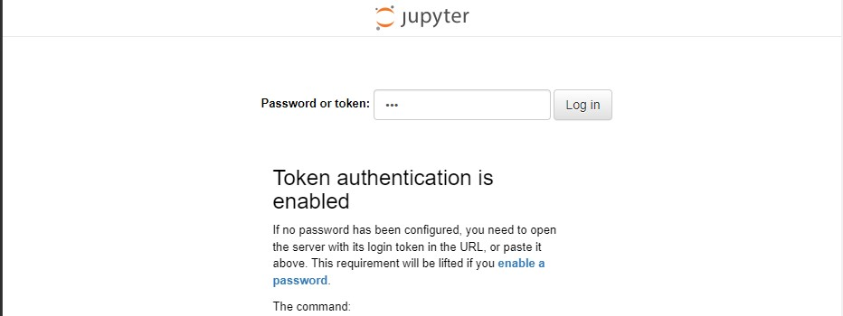
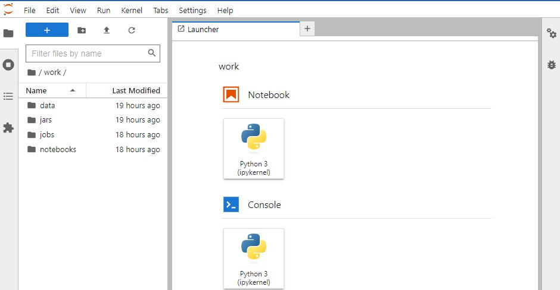
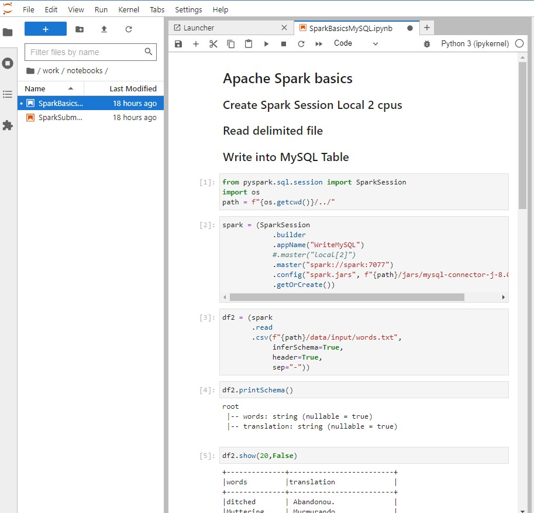
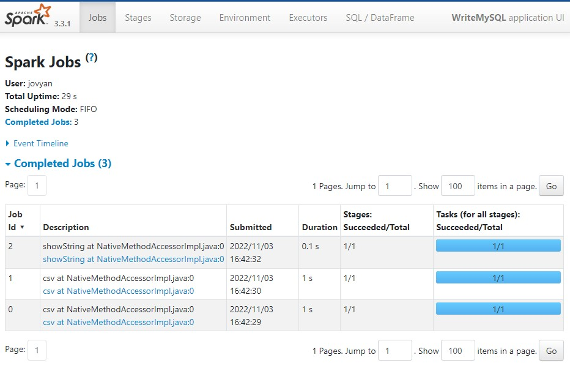
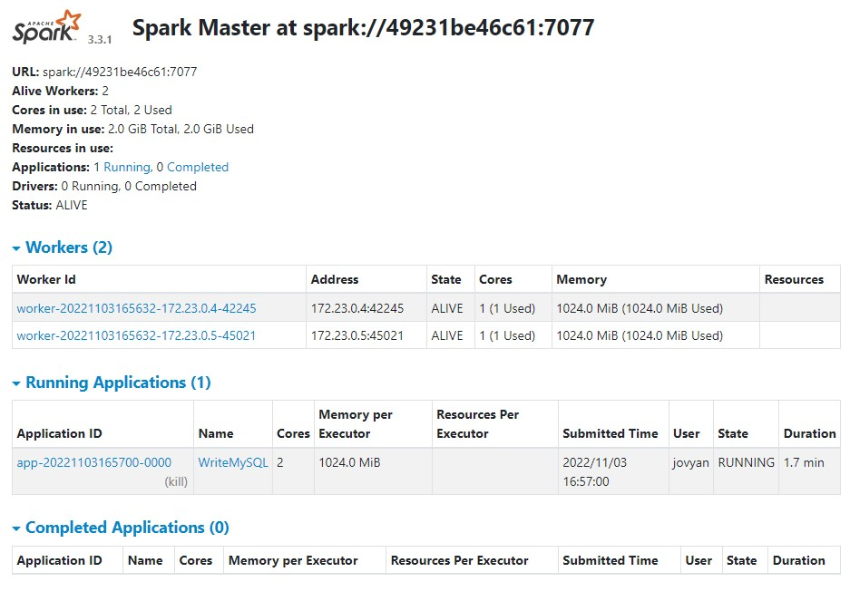
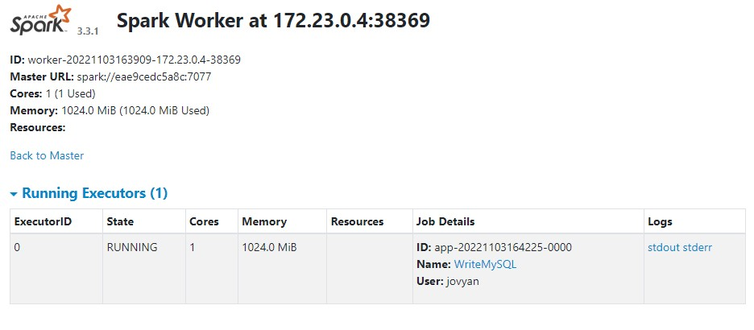

# Apache Spark Environment

### This set of infrastructure sets an apache spark 3.4.1 environment for an easy use, providing also an interactive jupyter lab environment.<br><br>  

<p> I have Provided two docker-compose files, the first in the project root sets a local spark cluster within jupyterlab while the one under the standalone folder sets a spark standalone cluster with a spark master and worker container plus jupyerlab and mysql.</p>
<br>

## Requirements
* Linux Operational System (Ubuntu 20.04 Prefered) or Windows and docker desktop.
* [Git Versioning Software ](https://git-scm.com/download/linux)
* [Docker Container Virtualization Software](https://docs.docker.com/engine/install/ubuntu/)
* [Docker-Compose multi-container Docker applications](https://docs.docker.com/compose/install/) (Already available with docker desktop windows.)
<br>

# Instructions
Clone this repository into your linux/windows working directory and navegate into it.  
  
Run the following commands:
```

# Create Local Folder and give permissions
sudo mkdir sparkenv && sudo chmod -R 777 sparkenv && cd sparkenv (Linux)
mkdir sparkenv ; cd sparkenv (Windows)

# Clone Git repository to the created folder
git clone https://github.com/mpavanetti/sparkenv.git .

# Run docker compose (Spark Local Environment within jupyerlab)
sudo docker-compose up -d  (Linux)
docker-compose up -d (Windows)

# Run docker compose (Spark Cluster Standalone)
cd ./standalone/
sudo docker-compose up --scale spark-worker=2 -d  (Linux)
docker-compose up --scale spark-worker=2 -d  (Windows)

# Add permissions
sudo chmod -R 777 ./ (Linux)
```

## Accesses

### Jupyterlab
Access the jupyterlab UI through the link http://localhost:8888/  

* Token: tad  
* Password: \<Set your own password as you want>

### Mariadb

* Host: localhost
* Port: 3306
* Version 10.07
* Root User: root
* Root Password: root
* MySQL User: mysql
* MySQL Password: mysql
* Main Database: data


### Spark UI
Access the Spark UI through the link http://localhost:4040/  

This is all you need in case you take the spark local deployment option.

<hr>

## Spark Standalone Mode

Spark Master Url: http://localhost:8080/ <br>

Note you can set the number of spark workers while running the docker-compose command, setting the parameter --scale sparker-workers=\<NUMBER OF WORKERS>

<hr>

## Images

### Jupyterlab welcome screen:
Token = tad


### Jupyterlab workspace with pre defined basic notebooks, jobs, jars and data.


### Apache Spark basic sample notebook connecting to standalone cluster or local and mysql.


### Spark UI


### Spark Standalone deployment - Spark Master with 2 workers.


### Spark Worker

